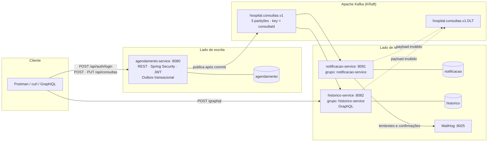
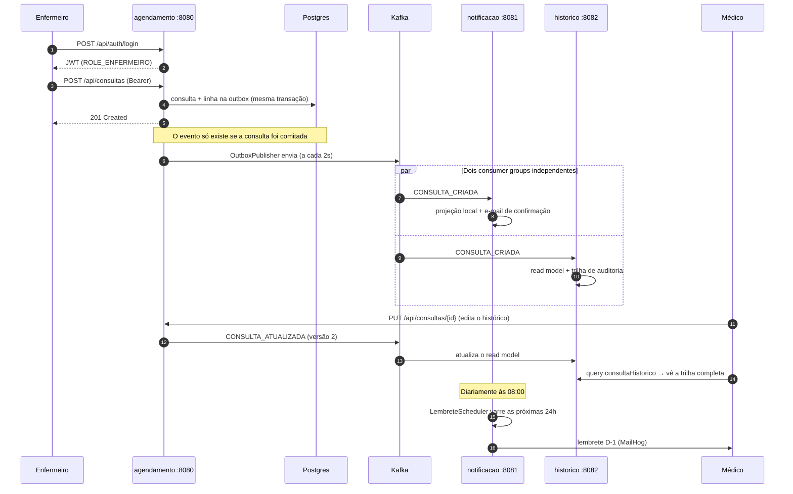

# Tech Challenge Fase 3 — Backend Hospitalar com Apache Kafka

Sistema hospitalar em microsserviços para agendamento de consultas, com **Spring Security**,
**GraphQL** e **comunicação assíncrona via Apache Kafka**.

FIAP — Pós-graduação em Arquitetura e Desenvolvimento Java · Tech Challenge Fase 3

> O enunciado marca o **serviço de histórico como opcional** e permite **RabbitMQ ou Kafka**.
> Aqui o histórico foi implementado como serviço próprio e obrigatório, e a mensageria é Kafka.

---

## Arquitetura



### O fluxo completo de uma consulta



### Serviços

| Serviço | Porta | Papel | API |
|---|---|---|---|
| `agendamento-service` | 8080 | Lado de escrita. Autentica, emite o JWT, registra e edita consultas, publica eventos. | REST + Swagger |
| `notificacao-service` | 8081 | Consome eventos, envia confirmações e lembretes D-1. | REST (trilha) |
| `historico-service` | 8082 | Lado de leitura. Read model construído do log de eventos. | **GraphQL** |
| `comum` | — | Contrato do evento + camada JWT compartilhada. | biblioteca |

### Stack

Java 21 · Spring Boot 3.5.16 · Spring Security (JWT/HS256) · Spring for GraphQL ·
Spring for Apache Kafka · Spring Data JPA · Flyway · PostgreSQL 16 · Apache Kafka 3.9.2 (KRaft) ·
Maven multi-módulo · JUnit 5 · Mockito · AssertJ · EmbeddedKafka · H2 · JaCoCo · Docker Compose

---

## Como executar

Requisitos: Docker e Docker Compose. Nada mais — não é preciso ter Java ou Maven instalados.

```bash
docker compose up --build
```

Um único comando: o Postgres cria as três bases, o Flyway aplica os schemas e a massa inicial,
e o `agendamento-service` cria os tópicos do Kafka na subida. As aplicações só iniciam depois
que Kafka e Postgres passam no healthcheck.

| O quê | Onde |
|---|---|
| Swagger (API de agendamento) | http://localhost:8080/swagger-ui.html |
| GraphiQL (histórico) | http://localhost:8082/graphiql |
| Kafka UI — tópicos, mensagens e lag | http://localhost:8090 |
| MailHog — caixa de entrada | http://localhost:8025 |
| Health checks | `:8080` `:8081` `:8082` + `/actuator/health` |

### Rodando os testes

```bash
./mvnw clean verify              # Linux/macOS
.\mvnw.cmd clean verify          # Windows
```

**Não é preciso Docker para os testes.** A suíte usa `@EmbeddedKafka` e H2 em modo PostgreSQL,
rodando as migrações Flyway reais.

### Vendo o agendador de lembretes em ação

O lembrete D-1 roda às 08:00. Para não esperar, suba disparando a cada minuto:

```bash
CRON_LEMBRETES="0 * * * * *" docker compose up
```

Acompanhe as mensagens chegando em http://localhost:8025.

---

## Usuários e permissões

Todos com a senha **`senha123`** (hashes BCrypt na migração `V2`).

| E-mail | Perfil | Id |
|---|---|---|
| `medico@hospital.com` | MEDICO | 1 |
| `medico2@hospital.com` | MEDICO | 2 |
| `enfermeiro@hospital.com` | ENFERMEIRO | 3 |
| `paciente@hospital.com` | PACIENTE (Maria) | 4 |
| `paciente2@hospital.com` | PACIENTE (João) | 5 |

### Matriz de permissões — e onde cada exigência do enunciado é atendida

| Ação | MEDICO | ENFERMEIRO | PACIENTE | Trecho do enunciado |
|---|:--:|:--:|:--:|---|
| `POST /api/auth/login` | ✅ | ✅ | ✅ | "autenticação com Spring Security" |
| `POST /api/consultas` | ✅ | ✅ | ❌ | "Enfermeiros: podem **registrar consultas**" |
| `PUT /api/consultas/{id}` | ✅ | ❌ | ❌ | "Médicos: podem visualizar e **editar** o histórico de consultas" |
| `POST /api/consultas/{id}/cancelar` | ✅ | ❌ | ❌ | idem |
| `GET /api/consultas` | ✅ todas | ✅ todas | ✅ **só as suas** | "Pacientes: podem visualizar **apenas as suas** consultas" |
| GraphQL `historicoPaciente` | ✅ qualquer | ✅ qualquer | ✅ só o próprio | "Enfermeiros: ... e **acessar o histórico**" |
| GraphQL `minhasConsultas` · `consultasFuturas` | ✅ | ✅ | ✅ só as suas | "consultas flexíveis sobre o histórico médico" |
| `GET /api/notificacoes` | ✅ | ✅ | ❌ | visão operacional da equipe clínica |

**Sobre "médicos podem editar o histórico":** o `historico-service` é **estritamente somente
leitura** — não tem `type Mutation`. A edição do médico acontece no `PUT /api/consultas/{id}`,
único lado de escrita do sistema, e se propaga ao histórico pelo evento `CONSULTA_ATUALIZADA`.
A trilha `eventos` na resposta GraphQL é a evidência visível de que a edição chegou lá. Isso
preserva a separação CQRS e mantém o read model derivado 100% do log.

### Como a autorização é aplicada

Em **dois níveis**, porque as duas perguntas são diferentes:

- **Por papel** — `@PreAuthorize` no controller/resolver responde *"quem pode chamar isto?"*.
- **Por posse** — `ContextoSeguranca` na camada de serviço responde *"sobre quais dados?"*,
  decisão que depende do registro e não só do perfil.

Um paciente que pede o histórico de outro recebe **403 explícito**, nunca uma reescrita
silenciosa para o próprio id — reescrever mascararia a tentativa de acesso indevido.

---

## API

### Login

```bash
curl -X POST http://localhost:8080/api/auth/login \
  -H 'Content-Type: application/json' \
  -d '{"email":"medico@hospital.com","senha":"senha123"}'
```

```json
{
  "token": "eyJhbGciOiJIUzI1NiJ9...",
  "tipo": "Bearer",
  "nome": "Dra. Ana Lima",
  "perfil": "MEDICO",
  "expiraEm": "2026-09-02T22:30:00Z"
}
```

O mesmo token é aceito pelos três serviços — eles compartilham segredo e emissor.

### Registrar e editar consultas (REST)

```bash
TOKEN=$(curl -s -X POST http://localhost:8080/api/auth/login \
  -H 'Content-Type: application/json' \
  -d '{"email":"enfermeiro@hospital.com","senha":"senha123"}' | jq -r .token)

curl -X POST http://localhost:8080/api/consultas \
  -H "Authorization: Bearer $TOKEN" -H 'Content-Type: application/json' \
  -d '{"pacienteId":4,"medicoId":1,"dataHora":"2026-10-15T09:00:00","observacoes":"Retorno"}'
```

### Consultar o histórico (GraphQL)

```graphql
query {
  historicoPaciente(pacienteId: 4, filtro: { status: [AGENDADA], especialidade: "Cardiologia" }) {
    pacienteNome
    totalConsultas
    consultas {
      consultaId
      dataHora
      status
      medico { nome especialidade }
      eventos { tipo statusResultante versao ocorridoEm }   # trilha vinda do Kafka
    }
  }
}
```

Outras queries: `minhasConsultas`, `consultasFuturas`, `consultaHistorico(consultaId:)`,
`estatisticasPaciente(pacienteId:)`. Filtros aceitos: `apenasFuturas`, `status`, `de`, `ate`,
`especialidade`, `medicoId` — combináveis, todos opcionais.

### Semântica de erros

| Situação | REST | GraphQL (`errors[0].extensions.classification`) |
|---|---|---|
| Sem token / token inválido | `401` | `UNAUTHORIZED` |
| Perfil sem permissão, ou dado de outro paciente | `403` | `FORBIDDEN` |
| Registro inexistente | `404` | `NOT_FOUND` |
| Regra de negócio ou filtro inválido | `400` | `BAD_REQUEST` |

GraphQL responde **HTTP 200 mesmo em erro** — daí a distinção viver em `classification`.

---

## Mensageria

| Item | Valor |
|---|---|
| Tópico | `hospital.consultas.v1` — 3 partições |
| Chave | `consultaId` (garante ordem por consulta dentro da partição) |
| Dead letter topic | `hospital.consultas.v1.DLT` |
| Consumer groups | `notificacao-service` · `historico-service` |
| Tipos de evento | `CONSULTA_CRIADA` · `CONSULTA_ATUALIZADA` · `CONSULTA_CANCELADA` |

Payload:

```json
{
  "consultaId": 5, "tipoEvento": "CONSULTA_CRIADA", "status": "AGENDADA",
  "pacienteId": 4, "pacienteNome": "Maria Souza", "pacienteEmail": "paciente@hospital.com",
  "medicoId": 1, "medicoNome": "Dra. Ana Lima", "medicoEspecialidade": "Cardiologia",
  "dataHora": "2026-10-15T09:00:00", "observacoes": "Retorno",
  "versao": 1, "ocorridoEm": "2026-09-02T19:40:12.345Z"
}
```

**Tratamento de erro:** falha transitória tenta 3 vezes com 1s de intervalo; payload malformado
lança `EventoInvalidoException`, marcada como não-retryável, e vai **direto** para a DLT — não
adianta insistir num evento que nunca vai processar.

---

## Decisões de arquitetura (e por quê)

### 1. Kafka, e não RabbitMQ

O enunciado permite os dois. Aqui o Kafka não é decoração — três características dele são
exploradas de verdade:

- **Fan-out por consumer group.** Notificação e histórico leem o **mesmo** tópico com grupos
  distintos e offsets próprios. Adicionar um quarto consumidor (BI, auditoria) não exige mexer
  no produtor nem declarar bindings novos.
- **O log é durável e reprodutível.** Numa fila, a mensagem some quando é consumida. No Kafka
  ela permanece pelo tempo de retenção — e é isso que torna o histórico **reconstruível**
  (veja a seção de replay abaixo).
- **Ordem por chave.** Usar `consultaId` como chave garante que criação, atualização e
  cancelamento de uma consulta cheguem na ordem, sem serializar o tópico inteiro.

### 2. CQRS: REST escreve, GraphQL lê

O `agendamento-service` é o único lado de escrita; o `historico-service` só lê. Isso dá ao
GraphQL exatamente o papel em que ele é forte — consultas flexíveis sobre um modelo de leitura
já preparado — sem misturar validação de agendamento com montagem de resposta. O preço é a
consistência eventual (~1-2s), aceitável para um histórico médico.

### 3. Outbox transacional, e não publicação dentro da transação

O caminho ingênuo é publicar no Kafka dentro do `@Transactional` que salva a consulta. Se o
commit falhar depois do envio, os consumidores passam a conhecer uma **consulta fantasma** que
não existe no banco.

Aqui, `ConsultaService` grava a consulta **e** uma linha em `outbox_evento` na mesma transação.
Um `@Scheduled` (`OutboxPublisher`) publica o que já foi comitado e só então marca
`publicado_em`. A entrega é *at-least-once*; a idempotência fica com os consumidores.

### 4. Idempotência nos consumidores, por versão do agregado

Cada consulta carrega uma `versao` que incrementa a cada alteração e viaja no evento. Os dois
consumidores usam o **id da consulta de origem como chave primária** da sua projeção e
descartam evento cuja versão seja menor ou igual à já aplicada. Reentrega do broker ou evento
fora de ordem não corrompem o estado.

No histórico, isso é feito em duas gravações separadas: a **trilha** (`evento_consulta`,
append-only) registra tudo o que chegou, inclusive o que chegou atrasado; o **estado atual**
(`consulta_historico`) só avança.

### 5. Um módulo `comum` com o contrato do evento

Duplicar o contrato entre serviços é defensável quando eles têm ciclos de release
independentes. Não é o caso aqui: são **três** serviços no mesmo repositório e no mesmo
release, e **dois** consumidores do mesmo evento. Duplicar triplicaria a definição e nada
pegaria a divergência. O módulo é deliberadamente magro — sem Spring Boot, sem JPA — e há um
teste que trava os nomes dos campos serializados.

### 6. Uma base por serviço, num único container Postgres

Nenhum serviço lê a tabela do outro: o que um precisa do outro chega por evento. As três bases
são separadas de verdade (`agendamento`, `notificacao`, `historico`), mas num só container —
isolamento lógico completo sem gastar três Postgres na máquina de avaliação.

### 7. Falha de SMTP não descarta a projeção

Se o servidor de e-mail cai, `NotificacaoService` registra a notificação como `FALHA` e **não**
relança a exceção. Relançar desfaria a atualização da projeção e mandaria a mensagem para a DLT
por causa de um efeito colateral — o e-mail é a parte menos valiosa do processamento.

### 8. `@MapsId`: paciente e médico compartilham a chave do usuário

O `usuarioId` que viaja no token é, para um paciente, exatamente o `pacienteId` que viaja no
evento. A regra de posse vira uma comparação direta de ids — sem claim extra no JWT e sem os
serviços de leitura precisarem consultar o agendamento para saber quem é quem.

### 9. Datas como String ISO-8601 no contrato e no GraphQL

Mantém o payload legível no Kafka UI e evita depender de um scalar customizado
(`graphql-java-extended-scalars`) só para expor data e hora.

### 10. Migrações Flyway em SQL neutro

As mesmas migrações rodam no PostgreSQL de produção e no H2 dos testes, com
`ddl-auto: validate`. Qualquer divergência entre entidade e DDL **quebra o build** em vez de
aparecer em produção.

---

## Prova de replay: reconstruindo o histórico a partir do log

Este é o argumento pró-Kafka em forma executável. Com o ambiente no ar e algumas consultas já
criadas:

```bash
# 1. Confira o estado atual do histórico
curl -s -X POST http://localhost:8082/graphql \
  -H "Authorization: Bearer $TOKEN" -H 'Content-Type: application/json' \
  -d '{"query":"{ estatisticasPaciente(pacienteId: 4) { total } }"}'

# 2. Destrua o read model por completo
docker compose stop historico-service
docker compose exec postgres psql -U hospital -d historico \
  -c "TRUNCATE consulta_historico, evento_consulta;"

# 3. Suba de novo com um consumer group novo, lendo o log desde o início
HISTORICO_GROUP_ID=historico-reconstrucao docker compose up -d historico-service

# 4. Repita a query do passo 1: os números voltaram.
```

Nada foi restaurado de backup — o histórico foi **reconstruído a partir dos eventos** que
continuam no tópico. Numa fila tradicional as mensagens já teriam sido consumidas e descartadas.

---

## Testes

**104 testes**, todos executáveis sem Docker.

| Módulo | Classe | Tipo | O que cobre |
|---|---|---|---|
| comum | `ContratoConsultaEventoTest` | JUnit | trava os nomes dos campos serializados e o round-trip |
| comum | `TokenServiceTest` | JUnit | assinatura adulterada, outro segredo, outro emissor, expirado |
| agendamento | `ConsultaServiceTest` | Mockito | posse, data no passado, double-booking, versionamento, outbox |
| agendamento | `SegurancaFluxoIntegrationTest` | MockMvc | login real por perfil, 401 sem/com token adulterado, 403 por papel e por posse |
| agendamento | `OutboxPublisherIntegrationTest` | **EmbeddedKafka** | pendente → publicado, chave da mensagem, versão nos eventos |
| agendamento | `MigracoesFlywayTest` | `@DataJpaTest` | migrações rodam, `validate` passa, seed com BCrypt, `@MapsId` |
| notificacao | `NotificacaoServiceTest` | Mockito | upsert idempotente, versão antiga descartada, SMTP fora do ar |
| notificacao | `LembreteSchedulerTest` | Mockito | janela de 24h, falha isolada não derruba o lote |
| notificacao | `ConsumoKafkaIntegrationTest` | **EmbeddedKafka** | evento → projeção → notificação; payload inválido → **DLT** |
| historico | `HistoricoGraphQlTest` | `GraphQlTester` | cada query, filtros combinados, `FORBIDDEN` sem vazar dados |
| historico | `ProjecaoHistoricoServiceTest` | `@SpringBootTest` | trilha vs. estado atual, evento fora de ordem, idempotência |
| historico | `ConsumoKafkaIntegrationTest` | **EmbeddedKafka** | Kafka → read model → resposta GraphQL, com trilha |

Relatório de cobertura JaCoCo em `<módulo>/target/site/jacoco/index.html` após `./mvnw verify`.

---

## Collection Postman

`postman/tech-challenge-kafka.postman_collection.json` — 34 requisições em 6 pastas,
**todas com asserções `pm.test`**. Os tokens são capturados automaticamente no login.

1. **Autenticação** — os quatro perfis + credenciais inválidas
2. **Agendamento (REST)** — registrar, listar, editar, cancelar
3. **Histórico (GraphQL)** — queries flexíveis e a trilha de eventos
4. **Acesso negado** — 401/403 no REST, `UNAUTHORIZED`/`FORBIDDEN`/`NOT_FOUND` no GraphQL
5. **Validações de domínio** — passado, double-booking, campos obrigatórios
6. **Notificações** — comprova que o evento Kafka produziu a notificação

Importe também `tech-challenge-kafka.postman_environment.json` e rode a collection inteira no
**Collection Runner**. As pastas estão na ordem correta; se alguma asserção da pasta 3 falhar
por corrida, configure um delay de 1000 ms no Runner (a propagação pelo Kafka leva ~1-2 s).

---

## Estrutura do repositório

```
tech-challenge-kafka/
├── comum/                        contrato do evento + camada JWT compartilhada
│   └── src/main/java/br/com/fiap/comum/
│       ├── evento/               ConsultaEvento, TipoEvento, StatusConsulta, Topicos
│       └── seguranca/            TokenService, JwtAuthenticationFilter, ContextoSeguranca
├── agendamento-service/          :8080 REST, Security, outbox, producer
├── notificacao-service/          :8081 consumer, projeção, lembretes, SMTP
├── historico-service/            :8082 consumer, read model, GraphQL
├── docker/postgres/init.sql      cria as três bases
├── postman/                      collection + environment
├── docker-compose.yml
└── pom.xml                       agregador multi-módulo
```
